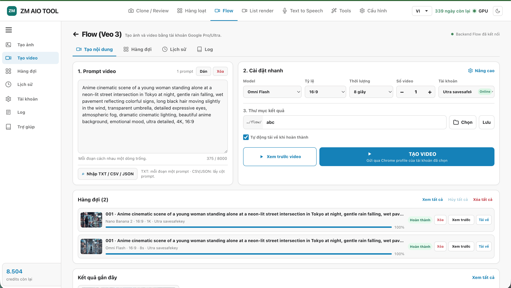
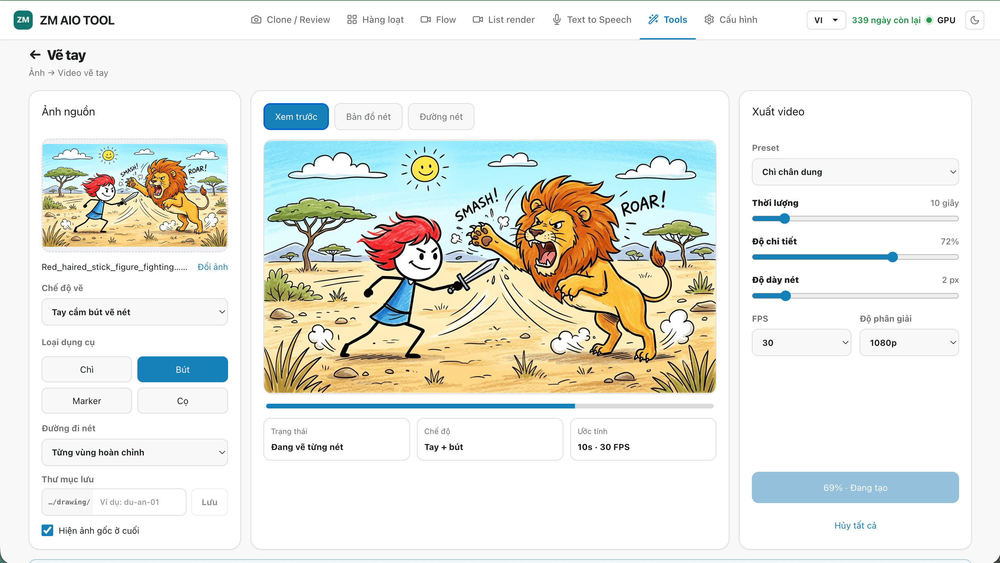

# ZM AIO TOOL — Video Clone & Film Review Studio

Ứng dụng desktop/web để dịch, lồng tiếng, biên tập timeline và tạo video review phim. ZM AIO TOOL ưu tiên xử lý cục bộ; dịch vụ cloud chỉ được dùng khi bạn chủ động chọn và cấu hình chúng.

[](package.json)
[](https://nodejs.org/)
[](https://www.python.org/)
[](LICENSE)

## Tính năng

| Khu vực | Dùng để làm gì |
|---|---|
| **Clone Video** | Nhận dạng lời thoại/SRT, dịch, TTS, che phụ đề cũ và xuất video. |
| **Live Preview** | Chỉnh caption, BBox che chữ, âm thanh, tốc độ, overlay, logo và timeline. |
| **Review Phim** | Phân cảnh, phân tích nội dung, tạo lời bình, ghép TTS và xuất recap. |
| **Hàng loạt** | Áp dụng cấu hình cho nhiều video trong hàng đợi. |
| **Flow (Veo 3)** | Tạo ảnh hoặc video bằng tài khoản Google Flow đã kết nối, có hàng đợi, lịch sử và preview kết quả. |
| **Text to Speech** | Tổng hợp TTS từ text/SRT; 413+ giọng từ zmAI, VieNeu, CapCut, ElevenLabs và hệ thống. |
| **Tải video & Tools** | Tải video, Cleaner, ghép video/ảnh + audio + SRT và tạo video vẽ tay. |

## Clone Video

1. Tạo project hoặc tải video vào.
2. Chọn nguồn nhận dạng: **Whisper**, **CapCut cloud**, **OCR chữ trên màn hình** hoặc **SRT**.
3. Chọn ngôn ngữ, công cụ dịch và tùy chọn tách người nói.
4. Chạy preview hoặc toàn video.
5. Chỉnh caption, BBox, TTS, âm gốc, logo/watermark và timeline trong Live Preview.
6. Xuất video, audio, SRT hoặc GIF.


### Nhận dạng và dịch

- **Whisper**: nhận dạng lời nói cục bộ.
- **CapCut cloud**: CapCut nhận dạng và dịch trong một tác vụ. Cloud chỉ trả trạng thái, không luôn trả phần trăm chính xác; UI hiển thị trạng thái và thời gian chờ thực tế.
- **OCR**: tạo track chữ trên màn hình riêng, không ghi đè caption thoại.
- **SRT**: import vào Media Library rồi áp dụng thành caption project.
- Dịch hỗ trợ Google, MyMemory, TikTok, Ollama và các provider cloud đã cấu hình.

### Live Preview Editor

- Timeline có video gốc, âm gốc, caption, lồng tiếng, watermark/overlay và media import.
- Caption nguồn và caption dịch là hai track dữ liệu độc lập; mặc định hiển thị track dịch.
- BBox che chữ tách biệt với watermark/logo, có thể kéo thả hoặc nhập tọa độ.
- Media Library hỗ trợ video, audio, ảnh, SRT và LUT; asset được lưu theo project.
- Preview nhanh dùng cùng pipeline render với export cho đoạn thời gian đã chọn.


### Tạo kiểu caption

Font, màu, nền, viền và bố cục caption được chỉnh trong Inspector; preview và export sử dụng cùng dữ liệu bố cục.


## Review Phim

Review Phim dùng pipeline riêng, không thay đổi project Clone Video:

1. Phát hiện cảnh và lấy transcript.
2. Phân tích hình/cốt truyện theo block cảnh.
3. Viết lời bình dựa trên bằng chứng của cảnh.
4. Tạo TTS, ghép cảnh và che phụ đề gốc theo lane đã xác định.
5. Xuất video hoàn chỉnh hoặc mở project trong editor.

Tiến trình hiển thị theo stage và số mục hoàn thành. Các tác vụ dài có thể hủy; backend nhận cờ hủy và dừng tiến trình con liên quan.


## Flow (Veo 3)

Flow tạo ảnh và video qua tài khoản Google **Pro** hoặc **Ultra** đã kết nối. Chọn model, tỷ lệ, độ phân giải, số lượng và tài khoản trước khi gửi prompt vào hàng đợi.

- Hỗ trợ **Text → Ảnh**, **Ảnh → Ảnh**, **Tham chiếu → Ảnh** và tạo video từ prompt/khung hình.
- Prompt có thể nhập tay, dán từ clipboard hoặc import TXT, CSV, JSON.
- Mỗi job lưu lại model, tỷ lệ, thời lượng, tài khoản, output và trạng thái để xem lại/chạy lại.
- WEB: chọn thư mục một lần để tự ghi output vào `ZM_AIO_TOOL/flow/<tên-thư-mục>/` khi hoàn thành. APP lưu vào thư mục output đã chọn.
- Có preview video mới nhất, hàng đợi, lịch sử, log, hủy/xóa từng job hoặc toàn bộ hàng đợi.

### Model theo gói tài khoản

| Model | Pro | Ultra |
|---|:---:|:---:|
| Veo 3.1 - Lite | ✅ | ✅ |
| Veo 3.1 - Fast | ✅ | ✅ |
| Veo 3.1 - Quality | ✅ | ✅ |
| Omni Flash | ✅ | ✅ |
| Veo 3.1 - Lite [Lower Priority] | ❌ | ✅ |



## Vẽ tay

Công cụ Vẽ tay biến ảnh thành video mô phỏng quá trình vẽ. Chọn ảnh nguồn, kiểu nét và preset xuất; sau đó kiểm tra preview trước khi tạo video.

- Hỗ trợ chế độ tay cầm bút vẽ nét, bút chì, marker và cọ.
- Tinh chỉnh thời lượng, độ chi tiết, độ dày nét, FPS, độ phân giải và thứ tự đường nét.
- Xem preview, bản đồ nét và đường nét trước khi render.
- Có thể đưa nhiều ảnh vào **Vẽ tay hàng loạt** để tạo job và chạy theo hàng đợi.



## TTS và phần cứng

- **413+ giọng** từ zmAI (online catalog), VieNeu, CapCut, ElevenLabs và giọng hệ thống — hiển thị đầy đủ trên cả web lẫn app.
- Hồ sơ người nói gồm tên vai, màu caption và giọng; đổi giọng sẽ tạo lại TTS của đúng vai đó.
- NVIDIA dùng CUDA khi runtime tương thích; Apple Silicon dùng Metal/CoreML khi hỗ trợ; nếu không sẽ fallback CPU.
- FFmpeg dùng encoder phần cứng khi máy và bản FFmpeg hỗ trợ.

Vào **Cấu hình → Thiết lập/Tài nguyên** để xem trạng thái runtime và cài model theo nhu cầu.


## Tải video và công cụ media

Tải video từ URL, đưa thẳng video vào Clone/Review, hoặc dùng các công cụ độc lập để dọn watermark và ghép media với audio/SRT.


### Video Cleaner

Cleaner xử lý logo, watermark và vùng chữ theo thời gian; chọn blur, nền màu hoặc phương án inpaint khi runtime hỗ trợ.


### Ghép media, audio và SRT

Ghép ảnh/video với audio và phụ đề, phù hợp để tạo video theo kịch bản hoặc audio có sẵn.


## Chạy từ mã nguồn

### Yêu cầu

- Node.js 20+ (workflow release dùng Node 24).
- Python 3.12.
- FFmpeg và FFprobe trong `PATH`.
- macOS hoặc Windows được hỗ trợ chính thức bởi workflow build hiện tại.

### Cài đặt nhanh

```bash
git clone https://github.com/manhgdev/zm_aio_tools.git
cd zm_aio_tools
npm run setup
npm run dev:all
```

- Web UI: `http://127.0.0.1:5173`
- API: `http://127.0.0.1:8787`
- API docs: `http://127.0.0.1:8787/docs`

`npm run dev:all` chỉ quản lý hai cổng 5173 và 8787 của project. Dừng lệnh bằng `Ctrl+C` để tắt cả Vite và API.

### Các lệnh thường dùng

| Lệnh | Mục đích |
|---|---|
| `npm run setup` | Cài dependency và chuẩn bị môi trường. |
| `npm run dev:all` / `npm start` | Chạy Vite + FastAPI. |
| `npm run dev` | Chạy riêng Vite. |
| `npm run build` | Type-check TypeScript và build frontend. |
| `npm run test:i18n` | Kiểm tra catalog Việt/Anh. |
| `npm run build:app` | Đóng gói desktop app. |
| `npm run check:build` | Kiểm tra artifact desktop. |
| `npm run release -- patch` | Bump patch version, tạo tag và push lên GitHub (trigger CI build). |

## Cấu hình cloud tùy chọn

Nhập key ở **Cấu hình**, hoặc tạo `backend/.env` từ `backend/.env.example`:

```env
OPENAI_API_KEY=...
GEMINI_API_KEY=...
DEEPSEEK_API_KEY=...
OPENROUTER_API_KEY=...
ELEVENLABS_API_KEYS=key_1,key_2
```

Không commit file `.env` hoặc API key vào Git.

## Đóng gói và phát hành

```bash
# Phát hành patch (ví dụ 3.7.3 → 3.7.4) — bump version + tag + push trong một lệnh
npm run release -- patch

# Hoặc chỉ định thẳng version
npm run release -- 3.8.0
```

Artifact local được tạo trong `build_app/release/`. GitHub Actions build macOS và Windows khi push tag theo dạng `v*` và đính kèm package vào GitHub Release. Tên file `.pkg`/`.zip` phải khớp với tag — script `release` đảm bảo điều này tự động.

Trước khi release:

```bash
npm run test:i18n
npm run build
PYTHONPATH=backend backend/.venv/bin/python -m pytest tests/backend
```

## Dữ liệu

- Chạy từ source: project media/cache nằm trong `backend/public/<project_id>/`.
- Desktop app dùng thư mục dữ liệu ứng dụng của hệ điều hành.
- Xóa project hoặc asset từ UI phải xóa dữ liệu backend tương ứng; asset đang được timeline sử dụng sẽ không được xóa.
- Video gốc, export và voice clone có thể chiếm nhiều dung lượng; dọn chúng trong quản lý project/cache.

## Cấu trúc mã nguồn

```text
frontend/src/       React + TypeScript + Vite
backend/api/        FastAPI routes và schema
backend/pipeline/   ASR, OCR, dịch, TTS, Review, export và media
build_app/          Desktop launcher/build
scripts/            setup và dev runner
tests/              pytest và i18n tests
previews/           Ảnh minh họa giao diện
```

Xem thêm [STRUCTURE.md](STRUCTURE.md) để biết quy ước module.

## License

Phân phối theo [Apache License 2.0](LICENSE).
